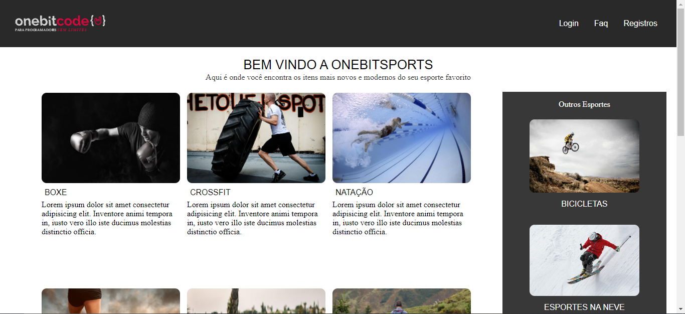

<h1 align="center"> FlexGridLayout</h1>

  <a href="#-tecnologias">Tecnologias</a>&nbsp;&nbsp;&nbsp;|&nbsp;&nbsp;&nbsp;
  <a href="#-projeto">Projeto</a>&nbsp;&nbsp;&nbsp;|&nbsp;&nbsp;&nbsp;

 

  

## 🚀 Tecnologias
Esse projeto foi desenvolvido com as seguintes tecnologias:

- HTML e CSS
- Git e Github

## 💻 Projeto

Projeto realizado para finalização do modulo css moderno do curso fullstack javascript da onebitcode, projeto tem como finalidade a pratica de layout responsivo, utilizando css flexbox, grid e midia query

## memo: Licença
Esse projeto está sob a licença MIT.
